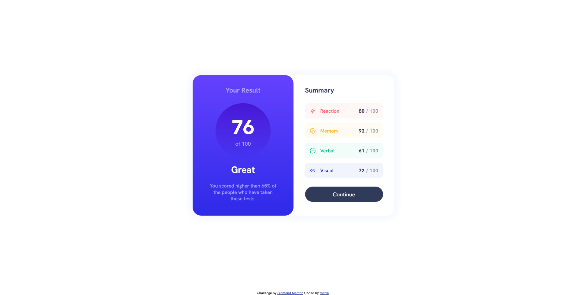

# FM-ResultsSummaryComponent
Frontend Mentor - Results summary component
| desktop | mobile |
| --- | --- |
|  |  |

If I had to do this challenge again I would make the containers have a left and right padding then just set each of the elements to 100% width (with some adjusting). That way I wouldn't have to set each of the elements widths individually.

Also I wasn't able to figure out how to make the "summary-container" to extend behind the "result-container", but I ended up kinda faking it with the ".shadow" container being the size of both of the containers and placing them.
